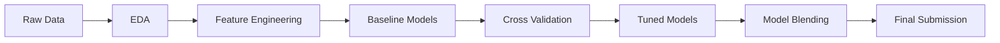

<div align="center">

# House Price Prediction

End-to-End Machine Learning Pipeline for the Kaggle Ames Housing Competition

---


</div>

---

## Overview

This project implements a complete machine learning pipeline for predicting residential housing prices using the Ames Housing dataset. The workflow covers data exploration, feature engineering, model development, evaluation, and final ensemble blending.

The objective is to minimize Root Mean Squared Logarithmic Error (RMSLE), aligning with the Kaggle competition evaluation metric.

---

## Project Structure

```text
house-price-prediction/
│
├── notebooks/
│   ├── 01_eda.ipynb
│   ├── 02_feature_engineering.ipynb
│   └── 03_modeling.ipynb
│
├── outputs/
│   ├── submission.csv
│   │
│   ├── modeling_outputs/
│   │   ├── model_cv_results.csv
│   │   ├── individual_model_predictions.csv
│   │   └── blend_weights.csv
│   │
│   └── catboost_info/
│       ├── learn_error.tsv
│       └── time_left.tsv
│
├── reports/
│   ├── feature_engineering.md
│   ├── model_summary.md
│   └── leaderboard_results.md
│
├── images/
├── README.md
├── requirements.txt
├── .gitignore
└── LICENSE
```

---

## Project Overview

This project follows a complete machine learning pipeline:



---

## Methodology

**1. Data Preparation**

- Missing values handled using domain-aware strategies
- Outliers analyzed and treated where necessary
- Categorical variables encoded appropriately
- Numerical features transformed for stability

Target transformation:

```Plain text
y = log(SalePrice)
```

Predictions converted back using:

```Plain text
SalePrice = exp(predictions)
```

**2. Feature Engineering**

Key transformations include:
- Interaction features between important variables
- Polynomial expansions for non-linear relationships
- Aggregated neighborhood-based statistics
- Log transformations for skewed distributions

The focus was on improving signal quality rather than increasing feature count.

**3. Model Development**

The following models were evaluated:

**Linear Models**
- Ridge
- Lasso
- ElasticNet
- Bayesian Ridge

**Tree-Based Models**
- Random Forest
- Gradient Boosting
- Boosting Models
- XGBoost
- LightGBM
- CatBoost

Linear models were scaled using RobustScaler. Tree-based models were used without scaling.

**4. Evaluation Strategy**

All models were evaluated using 5-Fold Cross Validation.

Metric used:
```Plain text
RMSE on log-transformed SalePrice
```

This ensures alignment with the Kaggle RMSLE objective.

---

## Model Performance

Cross-validation results are stored in:

```Plain text
outputs/modeling_outputs/model_cv_results.csv
```

**Baseline Models**

|**Model**|**CV RMSE**|
|---------|-----------|
|CatBoost|0.12407|
|Lasso|0.12595|
|ElasticNet|0.12604|
|XGBoost|0.12652|
|GradientBoosting|0.12729|

**Tuned Models**

|**Model**|**CV RMSE**|
|---------|-----------|
|Tuned CatBoost|0.12406|
|Tuned GradientBoosting|0.12457|
|Tuned Lasso|0.12600|
|Tuned ElasticNet|0.12617|
|Tuned XGBoost|0.12656|

**Observations**
- Boosting models capture complex nonlinear relationships effectively
- Regularized linear models remain competitive due to strong feature engineering
- Model diversity enables effective ensemble construction

---

## Model Blending

Final predictions are generated using inverse-RMSE weighted averaging.

**Weighting Formula**

```Plain text
weight = 1 / RMSE
```

Normalized weights:

```Plain text
weight = weight / sum(weights)
```

Blend weights are stored in:

```Plain text
outputs/modeling_outputs/blend_weights.csv
```

**Rationale**

- Stronger models contribute more to the final prediction
- Weak models are automatically down-weighted
- Reduces variance and improves generalization

---

## Prediction Analysis

Individual model predictions are available in:

```Plain text
outputs/modeling_outputs/individual_model_predictions.csv
```

Key observations:
- Boosting models show tighter prediction distributions
- Linear models provide stability
- Ensemble reduces extreme prediction variance

---

## Final Submission

Submission file:

```Plain text
outputs/submission.csv
```

**Format**

|**Id**|**SalePrice**|
|------|-------------|


**Kaggle Result**

Public Leaderboard Score:

```Plain text
0.12193 RMSLE
```

This score reflects strong generalization and effective ensemble modeling.

---

## How to Run

```Bash
# Clone repository
git clone https://github.com/Nomusa990822/house-price-prediction.git

# Navigate into project
cd house-price-prediction

# Install dependencies
pip install -r requirements.txt
```

Run notebooks in order:

```
01_eda → 02_feature_engineering → 03_modeling
```

---

## Key Insights

- Feature engineering is the primary driver of performance
- Ensemble learning outperforms individual models
- Model diversity is more valuable than model complexity
- Proper validation prevents overfitting

---

## What This Project Demonstrates
- End-to-end machine learning pipeline design
- Strong feature engineering techniques
- Robust validation strategModel comparison and optimization
- Ensemble learning and blending
- Reproducible data science workflow

---

## Future Improvements
- Advanced stacking (meta-model)
- Feature selection optimization
- SHAP-based model explainability
- Hyperparameter optimization using Optuna
- Deployment as a prediction API

---

## License
This project is licensed under the MIT License.
