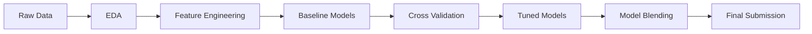

<div align="center">

# House Price Prediction

End-to-End Machine Learning Pipeline for the Kaggle Ames Housing Competition

---


</div>

---

## Problem Statement

The goal of this project is to predict residential house prices using the Ames Housing dataset from Kaggle.

This is a structured regression problem involving:
- Heterogeneous features
- Missing values
- Non-linear relationships
- Skewed target distribution

---

## Project Overview

This project follows a complete machine learning pipeline:



---

## Dataset

Source: Kaggle House Prices Competition
Training samples: 1460
Test samples: 1459
Features: 275 engineered features

---

## Key Techniques

**Feature Engineering**

- Log transformation of target variable
- Missing value imputation
- Ordinal encoding for categorical features
- Skewness correction
- Feature scaling using RobustScaler
- Interaction features (area, quality, age)

**Modeling**

- Linear Models:
  * Ridge
  * Lasso
  * ElasticNet
  * Bayesian Ridge
- Tree-Based Models:
  * Random Forest
  * Gradient Boosting
  * Extra Trees
  * HistGradientBoosting
- Boosting Models:
  * XGBoost
  * LightGBM
  * CatBoost

**Evaluation**

- Metric: Root Mean Squared Log Error (RMSLE)
- Strategy: 5-Fold Cross-Validation

---

## Model Performance

**Baseline Models**

|**Model**|**CV RMSE**|
|---------|-----------|
|CatBoost|0.12407|
|Lasso|0.12595|
|ElasticNet|0.12604|
|XGBoost|0.12652|
|GradientBoosting|0.12729|

**Tuned Models**

|**Model**|**CV RMSE**|
|---------|-----------|
|Tuned CatBoost|0.12406|
|Tuned GradientBoosting|0.12457|
|Tuned Lasso|0.12600|
|Tuned ElasticNet|0.12617|
|Tuned XGBoost|0.12656|

---

## Final Model Strategy

The final prediction is generated using:
- Model selection from top-performing tuned models
- Weighted blending using inverse RMSE
- Prediction clipping to ensure valid outputs

---

## Final Result

```
Public Leaderboard Score: 0.12193 RMSLE
```

---

## Repository Structure

```
house-price-prediction/
│
├── notebooks/
│   ├── 01_eda.ipynb
│   ├── 02_feature_engineering.ipynb
│   └── 03_modeling_and_optimisation.ipynb
│
├── reports/
│   ├── model_summary.md
│   ├── feature_engineering.md
│   └── leaderboard_results.md
│
├── outputs/
│   ├── submission.csv
│   └── model_cv_results.csv
│
├── images/
│
├── requirements.txt
└── README.md
```

---

## How to Run

```Bash
# Clone repository
git clone https://github.com/Nomusa990822/house-price-prediction.git

# Navigate into project
cd house-price-prediction

# Install dependencies
pip install -r requirements.txt
```

Run notebooks in order:

```
01_eda.ipynb
02_feature_engineering.ipynb
03_modeling_and_optimisation.ipynb
```

---

## Future Improvements
- Advanced stacking (meta-model)
- Feature selection optimization
- SHAP-based model explainability
- Hyperparameter optimization using Optuna
- Deployment as a prediction API

---

## Author
Nomusa Shongwe
